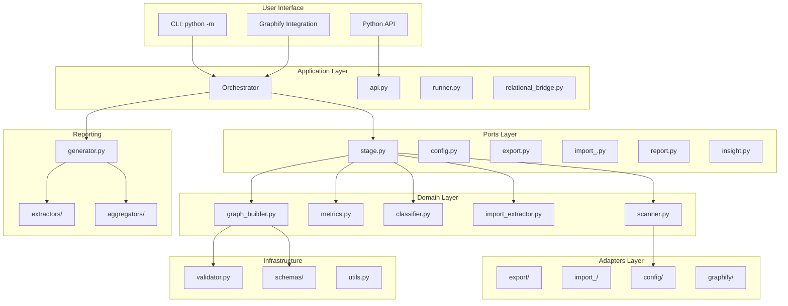
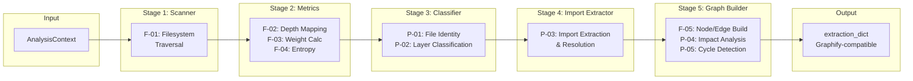
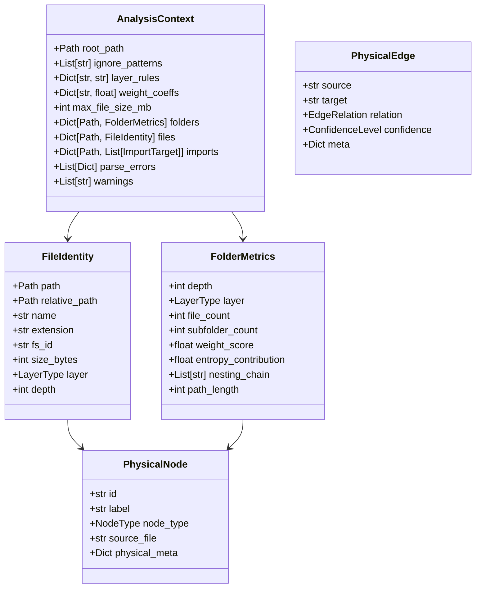
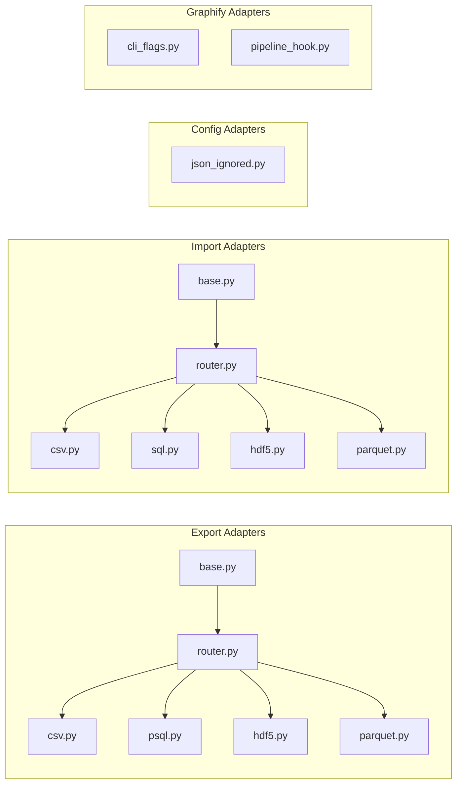
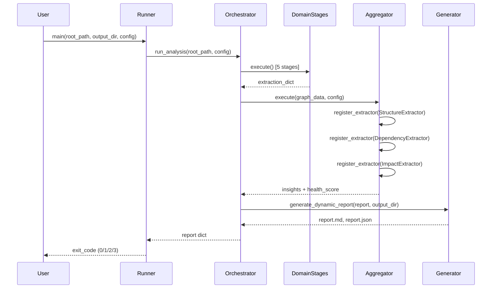
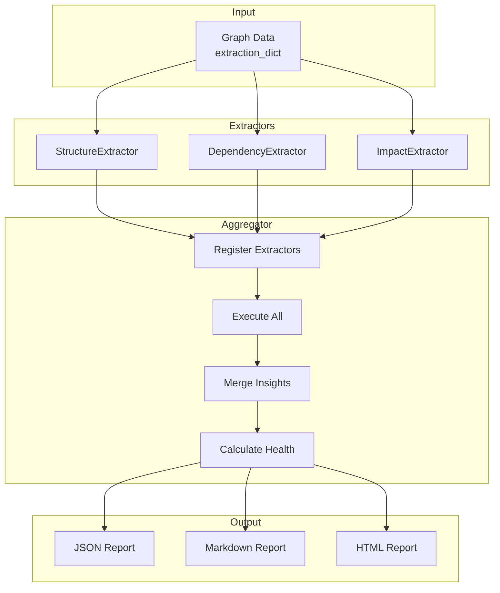
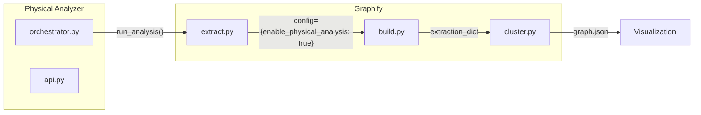

# Physical Analyzer - Architecture Documentation

## Table of Contents
1. [System Overview](#1-system-overview)
2. [Architectural Layers](#2-architectural-layers)
3. [Domain Pipeline](#3-domain-pipeline)
4. [Ports & Interfaces](#4-ports--interfaces)
5. [Adapters Layer](#5-adapters-layer)
6. [Application Orchestration](#6-application-orchestration)
7. [Reporting Pipeline](#7-reporting-pipeline)
8. [Graphify Integration](#8-graphify-integration)
9. [Data Flow](#9-data-flow)
10. [Configuration & Schema](#10-configuration--schema)

---

## 1. System Overview

### Purpose
Physical Analyzer is a codebase structure analysis tool that extracts physical file hierarchy, computes structural metrics, and generates Graphify-compatible knowledge graphs. It integrates with Graphify to enrich semantic understanding with physical filesystem context.

### Core Capabilities
- **Filesystem Traversal**: BFS/DFS with ignore pattern filtering
- **Structural Metrics**: Depth, weight scores, entropy calculation
- **Import Extraction**: Multi-language import resolution (Python, JS, Go, Java, etc.)
- **Graph Building**: Nodes/edges generation compatible with Graphify schema
- **Insight Detection**: Architecture health scoring, dependency analysis, impact analysis
- **Report Generation**: Markdown, JSON, HTML outputs

---

## 2. Architectural Layers



### Layer Responsibilities

| Layer | Responsibility | Dependencies |
|-------|---------------|--------------|
| **Domain** | Pure business logic, no I/O | ports (interfaces only) |
| **Ports** | Abstract interfaces/contracts | None (pure typing) |
| **Adapters** | External I/O implementations | ports (implementations) |
| **Application** | Orchestration, workflow coordination | domain, ports, adapters |
| **Infrastructure** | Schema validation, utilities | domain types |
| **Reporting** | Insight extraction, report generation | domain, ports/insight |

---

## 3. Domain Pipeline

The Domain Layer implements a 5-stage pipeline for physical analysis:



### Stage Details

| Stage | Module | Contracts | Output |
|-------|--------|-----------|--------|
| **F-01** | `scanner.py` | `IPhysicalStage` | folder_tree, folder_set, file_set |
| **F-02/F-03/F-04** | `metrics.py` | `IPhysicalStage` | depth_map, weight_map, global_entropy |
| **P-01/P-02** | `classifier.py` | `IPhysicalStage` | context.files (FileIdentity) |
| **P-03** | `import_extractor.py` | `IPhysicalStage` | context.imports |
| **F-05/P-04/P-05** | `graph_builder.py` | `IPhysicalStage` | extraction_dict |

### Key Data Structures (domain/types.py)



---

## 4. Ports & Interfaces

The Ports Layer defines abstract contracts (Protocols) for loose coupling:

```mermaid
classDiagram
    direction TB
    
    class IPhysicalStage {
        <<interface>>
        +str stage_id
        +execute(context) StageResult
    }
    
    class IPipeline {
        <<interface>>
        +run(root_path, **kwargs) Any
    }
    
    class IExportStrategy {
        <<interface>>
        +str format
        +export(data, path) None
        +validate(data) bool
    }
    
    class IImportStrategy {
        <<interface>>
        +str format
        +load(path) Dict
        +detect_schema(path) Schema
    }
    
    class IReportGenerator {
        <<interface>>
        +generate(data, output_path) None
        +format_html() str
        +format_markdown() str
    }
    
    class IConfigLoader {
        <<interface>>
        +load(path) Dict
        +save(config, path) None
    }
    
    class IInsightExtractor {
        <<interface>>
        +str extractor_id
        +default_thresholds() Dict
        +get_raw_findings(raw_) Dict
        +extract(raw_data, thresholds) List[InsightRecord]
    }
    
    class IReportAggregator {
        <<interface>>
        +register_extractor(extractor) None
        +execute(raw_data, config) Dict
        +calculate_health(insights, total_nodes, penalties) float
    }
    
    IPhysicalStage <|.. ScannerStage
    IPhysicalStage <|.. MetricsStage
    IPhysicalStage <|.. ClassifierStage
    IPhysicalStage <|.. ImportExtractorStage
    IPhysicalStage <|.. GraphBuilderStage
    
    IInsightExtractor <|.. StructureExtractor
    IInsightExtractor <|.. DependencyExtractor
    IInsightExtractor <|.. ImpactExtractor
    
    IReportAggregator <|.. InsightAggregator
```



### Interface Definitions

#### IPhysicalStage (ports/stage.py)
```python
@runtime_checkable
class IPhysicalStage(Protocol):
    @property
    def stage_id(self) -> str: ...
    
    def execute(self, context: Any) -> StageResult: ...
```

#### IInsightExtractor (ports/insight.py)
```python
@runtime_checkable
class IInsightExtractor(Protocol):
    @property
    def extractor_id(self) -> str: ...
    
    def default_thresholds(self) -> Dict[str, Any]: ...
    
    def get_raw_findings(self, raw_: Dict[str, Any]) -> Dict[str, Any]: ...
    
    def extract(self, raw_data: Dict[str, Any], thresholds: Dict[str, Any]) -> List[InsightRecord]: ...
```

---

## 5. Adapters Layer



### Adapter Pattern Implementation

**Export Router** (adapters/export/router.py):
```python
class ExportRouter:
    _REGISTRY: Dict[str, Type[IExportStrategy]] = {}
    
    @classmethod
    def register(cls, format: str, strategy_cls: Type[IExportStrategy]):
        cls._REGISTRY[format] = strategy_cls
    
    @classmethod
    def get_exporter(cls, format: str) -> IExportStrategy:
        if format not in cls._REGISTRY:
            raise ValueError(f"Unknown format: {format}. Available: {list(cls._REGISTRY.keys())}")
        return cls._REGISTRY[format]()
```

---

## 6. Application Orchestration



### API Entry Points (application/api.py)

```python
def run_analysis(root_path: str, config_overrides: Optional[Dict] = None) -> Dict[str, Any]:
    """
    [Contract: Public API - 08-IO-HighLevel]
    Synchronous entry point. Returns Graphify-compatible extraction_dict.
    Raises RuntimeError on failure.
    """

def run_analysis_safe(root_path: str, config_overrides: Optional[Dict] = None) -> Dict[str, Any]:
    """
    [Contract: Public API - Fail-Soft Variant]
    Returns result dict even on partial failure.
    Includes: success flag, data, errors, warnings, metadata.
    """
```

### Runner Exit Codes (application/runner.py)

| Exit Code | Meaning | Condition |
|-----------|---------|-----------|
| 0 | Healthy | health_score >= 80 |
| 1 | Warnings | 60 <= health_score < 80 |
| 2 | Critical | health_score < 60 |
| 3 | Runtime Error | Exception thrown |

---

## 7. Reporting Pipeline



### Insight Extractors

| Extractor | Purpose | Key Metrics |
|------------|---------|-------------|
| **StructureExtractor** | File/folder depth, layer distribution, nesting | depth_distribution, layer_counts |
| **DependencyExtractor** | Circular dependencies, unresolved imports | circular_deps, unresolved_count |
| **ImpactExtractor** | Entry point analysis, centrality scores | entry_points, impact_ratios |

### Health Score Calculation (reporting/aggregators/aggregator.py)

```python
def calculate_health(insights: List[InsightRecord], total_nodes: int, penalties: Dict[str, float]) -> float:
    """
    Base health = 100
    - Critical: -20 per issue
    - Warning: -10 per issue
    - Info: -5 per issue
    Returns: 0-100 score
    """
```

---

## 8. Graphify Integration

### Integration Points



### Activation (graphify_src/graphify/extract.py)

```python
def extract(paths: list[Path], cache_root: Path | None = None, config: dict | None = None) -> dict:
    """
    Extended with config parameter for Physical Analyzer integration.
    """
    config = config or {}
    
    # Original Graphify extraction
    result = original_extraction_logic(paths)
    
    # Physical Analyzer Extension
    if config.get("enable_physical_analysis", False):
        physical_result = _extract_physical(root=root, enable_physical=True)
        result["nodes"].extend(physical_result.get("nodes", []))
        result["edges"].extend(physical_result.get("edges", []))
        result["metadata"]["physical_analysis"] = {...}
    
    return result
```

---

## 9. Data Flow

```mermaid
flowchart LR
    subgraph "Phase 1: Discovery"
        D1[os.walk traversal]
        D2[Ignore pattern filter]
        D3[Folder tree build]
    end

    subgraph "Phase 2: Analysis"
        A1[BFS depth mapping]
        A2[Weight calculation]
        A3[Entropy calculation]
        A4[Layer classification]
    end

    subgraph "Phase 3: Extraction"
        E1[Regex import parsing]
        E2[Path resolution]
        E3[Cross-file resolution]
    end

    subgraph "Phase 4: Graph Build"
        G1[Node generation]
        G2[Edge generation]
        G3[Impact analysis]
        G4[Cycle detection]
    end

    subgraph "Phase 5: Reporting"
        R1[Insight extraction]
        R2[Health scoring]
        R3[Report generation]
    end

    D1 --> D2 --> D3
    D3 --> A1 --> A2 --> A3 --> A4
    A4 --> E1 --> E2 --> E3
    E3 --> G1 --> G2 --> G3 --> G4
    G4 --> R1 --> R2 --> R3
```



---

## 10. Configuration & Schema

### Configuration Files

| File | Purpose |
|------|---------|
| `adapters/config/json_ignored.py` | Load .graphifyignore patterns |
| `ports/config.py` | Config interface definition |
| `infrastructure/relational_schema_v1.py` | SQL table definitions |
| `infrastructure/graphify_schema_v1.py` | extraction_dict schema |

### Schema Validation (infrastructure/validator.py)

```python
def validate_graphify_schema(data: Dict[str, Any]) -> Tuple[bool, List[str]]:
    """
    Validates extraction_dict against Graphify strict schema.
    Checks: root keys, node/edge structure, enum values, referential integrity.
    """
```

---

## Appendix: File Inventory

| Directory | Files | Purpose |
|-----------|-------|---------|
| `domain/` | 6 | Pure business logic, 5-stage pipeline |
| `ports/` | 6 | Abstract interfaces/contracts |
| `adapters/export/` | 6 | Data export strategies |
| `adapters/import_/` | 6 | Data import strategies |
| `adapters/config/` | 1 | Configuration loading |
| `adapters/graphify/` | 2 | Graphify integration |
| `application/` | 7 | Orchestration & API |
| `infrastructure/` | 4 | Validation, schemas, utilities |
| `reporting/` | 8 | Insights & report generation |
| `graphify_src/` | Submodule | Graphify codebase |

---

## Next Steps

- See [CATALOG.md](./CATALOG.md) for detailed component inventory
- See [USAGE.md](./USAGE.md) for CLI reference and examples
- See [diagrams/](./diagrams/) for standalone Mermaid source files